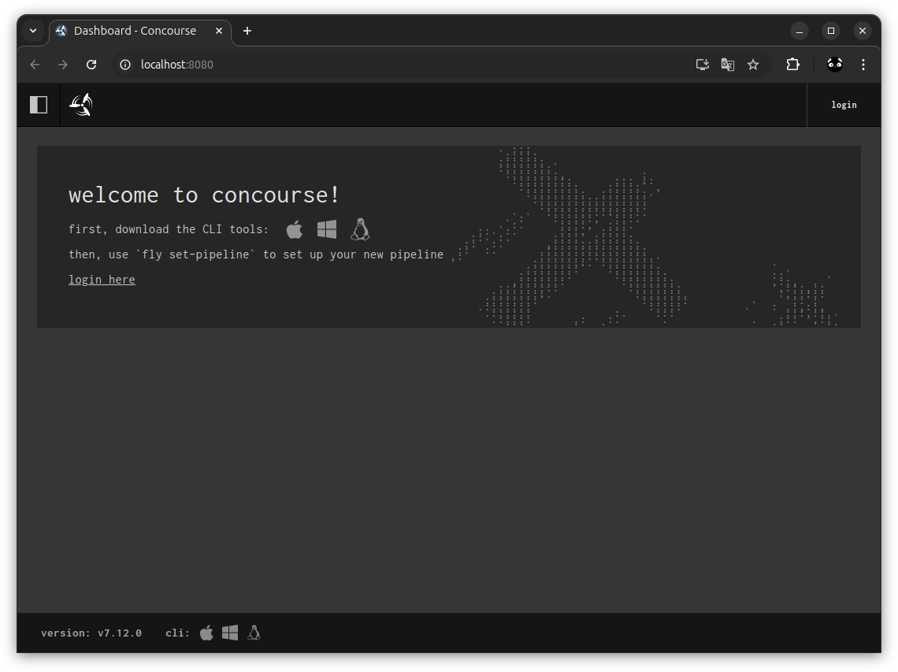
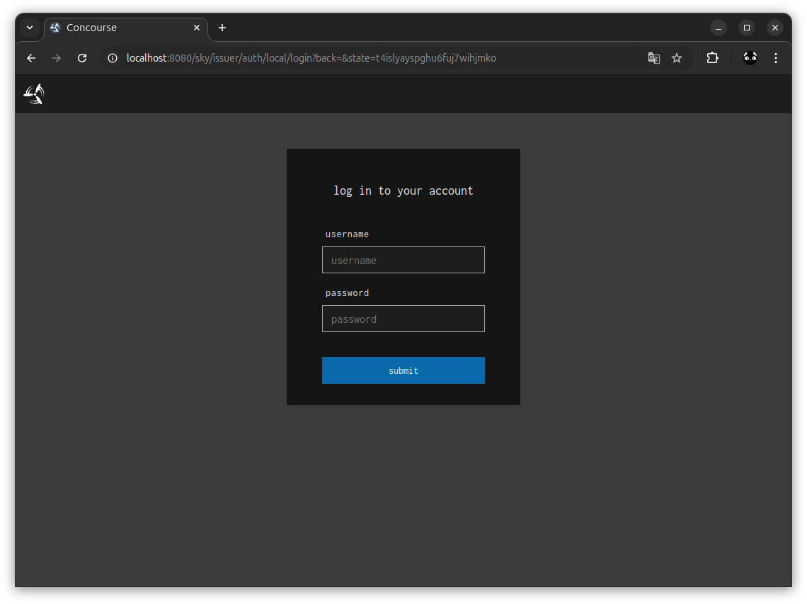
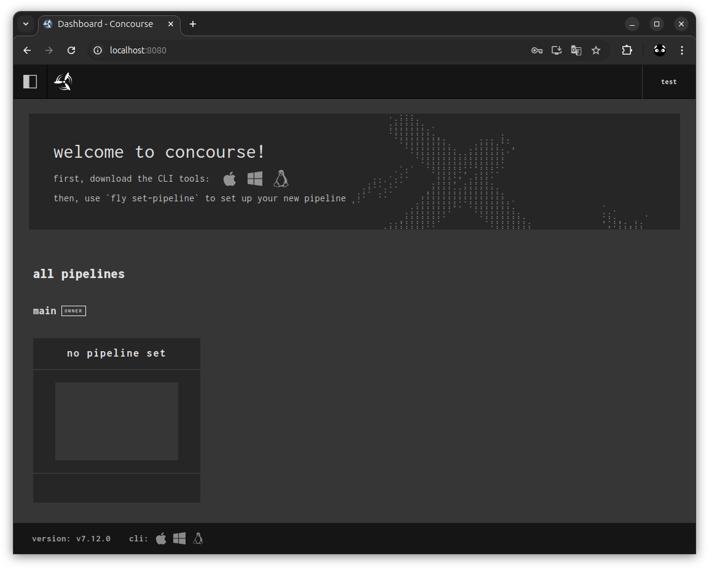
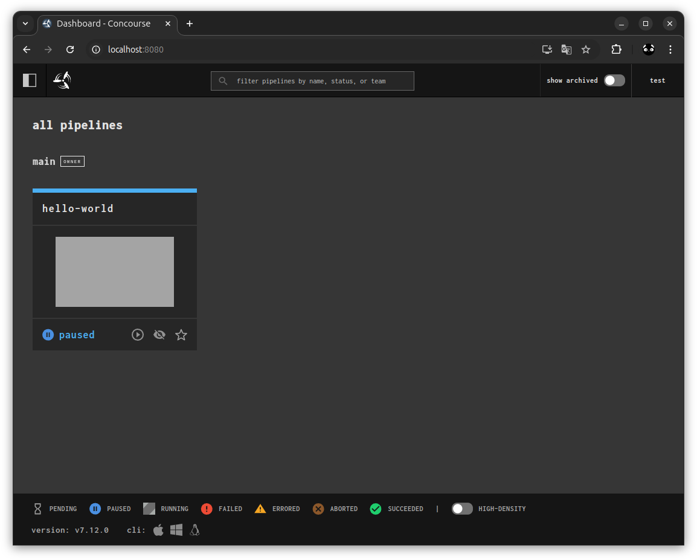
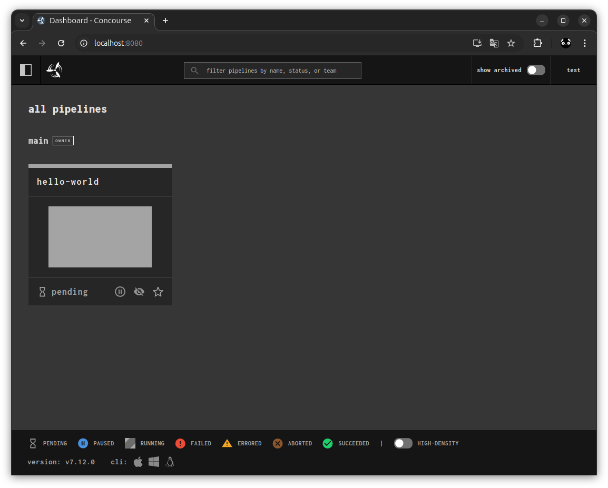
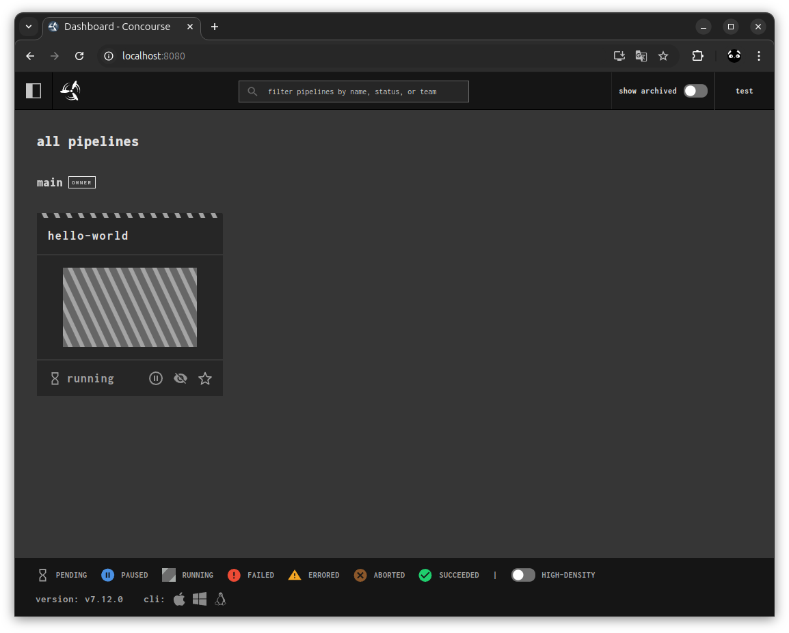
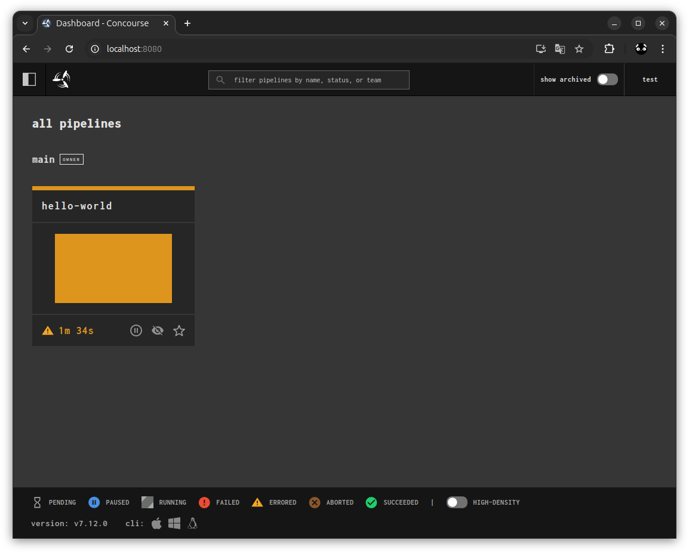
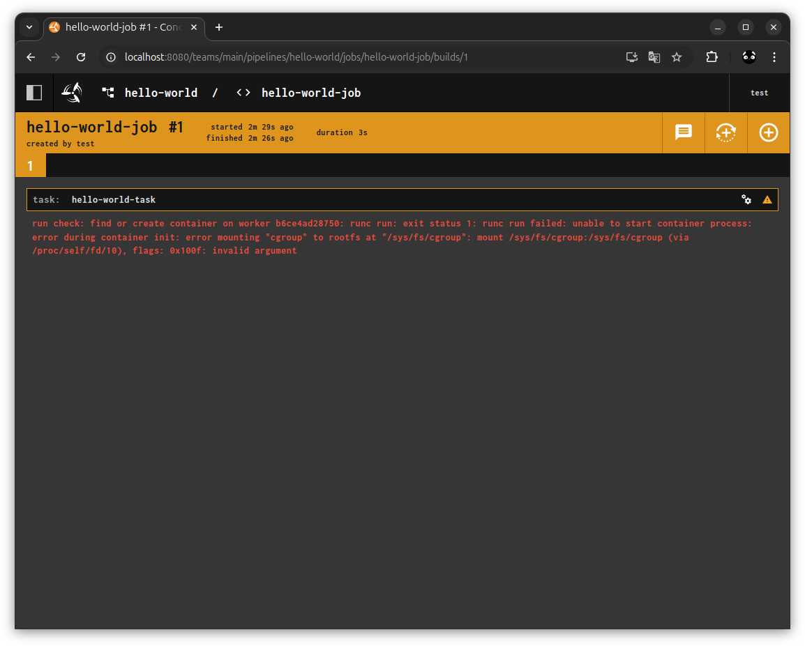

# concourse_ci_docker

## ※まだエラー

## 概要
* オープンソースの CI / CD ツール Concourse を Docker Compose で構築する

Concourse CI  
https://concourse-ci.org/  

Concourse CI - docs - 1.1.1 Quick Start - Docker Compose Concourse  
https://concourse-ci.org/quick-start.html#docker-compose-concourse  

GitHub - concourse-docker  
https://github.com/concourse/concourse-docker  

## 環境
* Ubuntu 24.04
* Docker version 27.4.0, build bde2b89
* Concourse CI 7.12

## 詳細

### 鍵を作成
```
sudo ./generate_keys.sh 
```

### 実行
```
docker compose up -d
```

### ログイン
* http://localhost:8080/
* 右上 login  
  ID: test  
  PW: test  

  
  
  

### CLI の Fly をインストール
Concourse CI - docs - 1.1.1 Quick Start - Install Fly
https://concourse-ci.org/quick-start.html#docker-compose-concourse  

```
curl 'http://localhost:8080/api/v1/cli?arch=amd64&platform=linux' -o fly
chmod +x ./fly
sudo mv ./fly /usr/local/bin/
```

```
$ fly --version
7.12.0
```

### Fly でログイン
Concourse CI - docs - 1.4 The fly CLI  
https://concourse-ci.org/fly.html  

```
fly login -t example -u test -p test -c http://localhost:8080
```

実行結果
```
$ fly login -t example -u test -p test -c http://localhost:8080
logging in to team 'main'


target saved
```

### Hello World Pipeline を試す
Concourse CI - docs - 1.1.2 Hello World Pipeline  
https://concourse-ci.org/tutorial-hello-world.html  


#### hello-world パイプラインを作成
```
fly set-pipeline -t example -p hello-world -c hello-world.yml
```

実行結果
```
$ fly set-pipeline -t example -p hello-world -c hello-world.yml
jobs:
  job hello-world-job has been added:
+ name: hello-world-job
+ plan:
+ - config:
+     image_resource:
+       name: ""
+       source:
+         repository: busybox
+       type: registry-image
+     platform: linux
+     run:
+       args:
+       - Hello world!
+       path: echo
+   task: hello-world-task
  
pipeline name: hello-world

apply configuration? [yN]: y
pipeline created!
you can view your pipeline here: http://localhost:8080/teams/main/pipelines/hello-world

the pipeline is currently paused. to unpause, either:
  - run the unpause-pipeline command:
    fly -t example unpause-pipeline -p hello-world
  - click play next to the pipeline in the web ui
```

  

#### aaa
```
fly unpause-pipeline -t example -p hello-world
```

実行結果
```
$ fly unpause-pipeline -t example -p hello-world
unpaused 'hello-world'
```

  

#### bbbb
ダメじゃん
```
fly trigger-job -t example --job hello-world/hello-world-job --watch
```

実行結果
```
$ fly trigger-job -t example --job hello-world/hello-world-job --watch
started hello-world/hello-world-job #1

initializing
initializing check: image
selected worker: b6ce4ad28750
run check: find or create container on worker b6ce4ad28750: runc run: exit status 1: runc run failed: unable to start container process: error during container init: error mounting "cgroup" to rootfs at "/sys/fs/cgroup": mount /sys/fs/cgroup:/sys/fs/cgroup (via /proc/self/fd/10), flags: 0x100f: invalid argument
run check: find or create container on worker b6ce4ad28750: runc run: exit status 1: runc run failed: unable to start container process: error during container init: error mounting "cgroup" to rootfs at "/sys/fs/cgroup": mount /sys/fs/cgroup:/sys/fs/cgroup (via /proc/self/fd/10), flags: 0x100f: invalid argument
errored
```

  
  
  